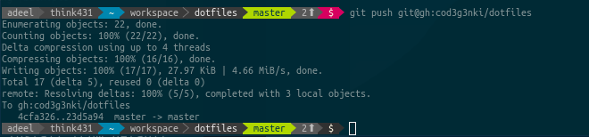

# Linux Desktop Environment config files
A collection of config files used to setup and maintain a uniform development environment across different machines.

## Contents
1. [bashrc](#bashrc)
2. [Conky](#Conky)
    1. [Setup dependencies](#setup-dependencies)
    2. [Autostart conky on startup](#autostart-conky-on-startup)
    3. [Screenshots](#screenshots)

3. [i3 tiling WM config](#i3-tiling-wm-config)


## bashrc

You can either copy one of the two script files to your home directory or soft link it there and add a source line in your `~/.bashrc` file:
   ```bash
# assuming you cloned this repo in ~/.config/dotfiles
ln -s ~/.config/dotfiles/.bashrc.env.sh ~/.bashrc.env.sh
source .bashrc.env.sh
   ```


For changes to take effect either run ```source ~/.bashrc``` from terminal or logout and login.

Both files, in addition to custom aliases and functions, print a custom prompt and are differentiated as follows:


- `.bashrc.cpwd.sh` prints a shell script based simple prompt


- `.bashrc.env.sh` prints a `powerline-shell` based prompt that can be installed using pip (python package manager):

    ```bash
    pip install powerline-shell
    ```



## Conky

First clone the repo in a directory (say `dotfiles`) inside `~/.config`. Then install and setup all the dependencies for a config of your choice as listed in the following table.

| Configuration | Dependencies                                                 |
| ------------- | ------------------------------------------------------------ |
| minimal# X    | *conky* (>= 1.10), *curl*, *jq*, *vnstat*                    |
| mixCxx        | *conky* (>= 1.10), *curl*, *jq*, *vnstat*                    |
| SpaceX        | *conky* (>= 1.10), *Python 3* (for optional `apt` script)    |
| StarWarp      | *conky* (>= 1.10), *curl*, *jq*, *vnstat*, Fonts (FontAwesome, Neuropolitical, Neuropol X) |

After setting up dependencies, soft link `conky` directory in `~/.config`.

```sh
# assuming you cloned this repo in ~/.config/dotfiles
ln -s ~/.config/dotfiles/conky ~/.config/conky
```


### Setup dependencies

To setup the dependencies on a Debian/Ubuntu based distro, install from upstream repo:
   ```bash
sudo apt-get install conky curl jq vnstat
   ```
`vnstat` initializes a db, for each network interface, in `/var/lib/vnstat`. To monitor an interface (say eth0), create a new db for it as:

   ```bash
vnstat --create -i eth0
   ```
To avoid *Permission denied* errors while querying `vnstat` data, change ownership of db files to `vnstat` `user:group` pair.  
   ```bash
sudo chown vnstat:vnstat /var/lib/vnstat/*
   ```
For weather updates and forcasts get an API key from [OpenWeatherMap](https://openweathermap.org "OpenWeatherMap's Homepage") and find [city id](http://openweathermap.org/help/city_list.txt "City ID List")  for city of your choice. Substitute these values against *template1* and *template2* variables in the config file.

### Autostart conky on startup

Edit `.conky/conky-startup.sh` file and substitute name of the script that launches configuration file of your choice. Add ```.conky/conky-startup.sh``` as a autostart application from system settings.

```sh
bash -c '/home/user/.config/conky/conky-startup.sh'
```


   ### Screenshots
   #### minimal# Hydrogen

   ###### 

   #### minimal# Helium

   ###### 

   #### minimal# Hydrogen Icon Mix

   ###### 

   #### minimal# Carbon
   

   

   

   #### SpaceX

   

   

   #### StarWarp
   


## i3 tiling WM config

This contains config files for my i3 WM setup.


[Top](#contents)
