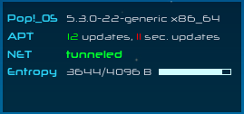

# Linux Desktop Environment config files
A collection of config files used to setup and maintain a uniform development environment across different machines and  distros (hopefully! :stuck_out_tongue_winking_eye: )

## Contents
1. [bashrc](#bashrc)
2. [zshrc](#zshrc)
3. [Terminal](#Terminal)
4. [Conky](#Conky)
    1. [Setup dependencies](#setup-dependencies)
    2. [Autostart conky on startup](#autostart-conky-on-startup)
    3. [Screenshots](#screenshots)
5. [Tiling WM configurations](#Tiling-WM-configurations)
  1. [i3](#i3)


## Initial Setup

There are scripts for inital setup of a fresh install:

- `setup_init.sh`: initial setup for cli and conky
- `setup_env.sh`: setup a base dev env (python, node, rust, go, alacritty, starship prompt, latex) 

## bashrc

### Aliases and Functions

The shell coustomizations comprise of three files in `sh/` directory:
- `.bashrc.env.sh`: paths and env vars
- `.bashrc.aliases.sh`: aliases
- `.bashrc.functions.sh`: functions for task automation

You can either copy these script files to your home directory or soft link there:
```bash
# assuming you cloned this repo in ~/.config/dotfiles
ln -s $HOME/.config/dotfiles/.bashrc.env.sh ~/.bashrc.env.sh
```
and source these files in `~/.bashrc` file:
```bash
if [ -f "~/.bashrc.env.sh" ]; then
    source "~/.bashrc.env.sh"
fi
```

For changes to take effect either run `source ~/.bashrc` from terminal or logout and login.

### `.bashrc.cpwd.sh`: Custom Prompt and Aliases

Both files, in addition to custom aliases and functions, print a custom prompt and are differentiated as follows:

For detailed information on bash functions and aliases look at relavent [readme file](sh/README.md).

- `.bashrc.cpwd.sh` prints a shell script based simple prompt


- `.bashrc.env.sh` prints a `starship` prompt that can be installed using pip (python package manager):

    ```bash
    cargo install starship --locked
    ```


## zshrc

The shell script directory also contains configuration files to setup a functional `zsh` environment.

- `.zshrc.min.zsh`: minimal `zsh` configuration
- `.zshrc.min.zsh`: a relatively robust `zsh` configuration using `zim` framework
- `.zshrc.env.sh`: paths and env vars
- `.zshrc.aliases.sh`: aliases
- `.zshrc.functions.sh`: functions and `zle` widgets for task automation
- `setup_zsh.sh`: a script to setup the `zsh` configuration

## Terminal

The information on DE specific configurations for alacritty terminal can be found [here](./term.md).

## Desktop Configurations

- Gnome Shell: minimal configuration with tiling, 
- Pop Shell: customized configuration
- i3wm: config files for my `i3wm` setup.

## Conky

First clone the repo in a directory (say `dotfiles`) inside `~/.config`. Then install and setup all the dependencies for a config of your choice as listed in the following table.

| Configuration | Dependencies                                                 |
| ------------- | ------------------------------------------------------------ |
| minimal# X    | *conky* (>= 1.10), *curl*, *jq*, *vnstat*                    |
| mixCxx        | *conky* (>= 1.10), *curl*, *jq*, *vnstat*                    |
| SpaceX        | *conky* (>= 1.10), *Python 3* (for optional `apt` script)    |
| StarWarp      | *conky* (>= 1.10), *curl*, *jq*, *vnstat*, Fonts (FontAwesome, Neuropolitical, Neuropol X) |

After setting up dependencies, soft link `conky` directory in `~/.config`.

```sh
# assuming you cloned this repo in ~/.config/dotfiles
ln -s ~/.config/dotfiles/conky ~/.config/conky
```


### Setup dependencies

To setup the dependencies on a Debian/Ubuntu based distro, install from upstream repo:
   ```bash
sudo apt-get install conky curl jq vnstat
   ```
`vnstat` initializes a db, for each network interface, in `/var/lib/vnstat`. To monitor an interface (say eth0), create a new db for it as:

   ```bash
vnstat --create -i eth0
   ```
To avoid *Permission denied* errors while querying `vnstat` data, change ownership of db files to `vnstat` `user:group` pair.  
   ```bash
sudo chown vnstat:vnstat /var/lib/vnstat/*
   ```
For weather updates and forcasts get an API key from [OpenWeatherMap](https://openweathermap.org "OpenWeatherMap's Homepage") and find [city id](http://openweathermap.org/help/city_list.txt "City ID List")  for city of your choice. Substitute these values against *template1* and *template2* variables in the config file.

### Autostart conky on startup

Edit `.conky/conky-startup.sh` file and substitute name of the script that launches configuration file of your choice. Add ```.conky/conky-startup.sh``` as a autostart application from system settings.

```sh
bash -c '/home/user/.config/conky/conky-startup.sh'
```


#### Weather API

The configurations that display current weather and forecast depend on some shell variables exported from `conky/.env` file by the respective startup script (like `starwarp-start.sh`). These variables are used by the HTTP GET request to the weather API. In order to use this feature, [register](https://home.openweathermap.org/users/sign_up) a free account with [OpenWeatherMap](https://openweathermap.org) and get an API key. Now, write a `.env` file in conky root directory `$HOME/.config/conky`. An example `.env` looks like

```sh
#!/usr/bin/env sh

export OWM_APIKEY="1234567890abcdefgh"
export OWM_QUERY="London,uk"
export OWM_CITYID="2643743" # city id for London, GB
export OWM_UNITS="metric"
export OWM_LOCALE="en_GB.UTF-8"	# use your preffered locale e.g. en_US.UTF-8
```

City ID list is available in the [compressed json file](https://bulk.openweathermap.org/sample/) from OWMap.

### Screenshots
#### minimal# Hydrogen

   ###### 

   #### minimal# Helium

   ###### 

   #### minimal# Hydrogen Icon Mix

   ###### 

   #### minimal# Carbon
   

   

   

   #### SpaceX

   

   

   #### StarWarp


   


[Top](#contents)
